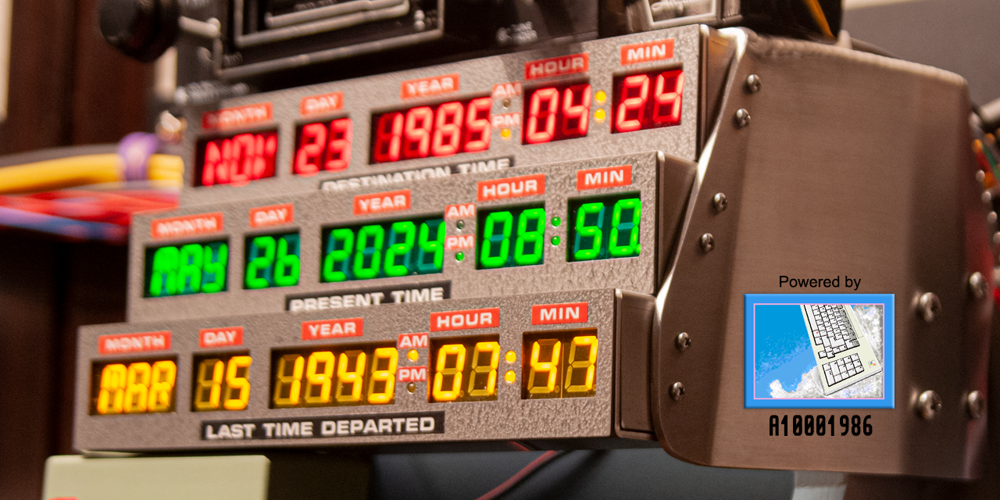

<H1>

Firmwares for <a href="https://circuitsetup.us" target=_blank>CircuitSetup</a> & A10001986 movie props

</H1>

---
Also available: [Amiga DSP 3210 drivers](https://github.com/realA10001986/AmigaDSP3210)
